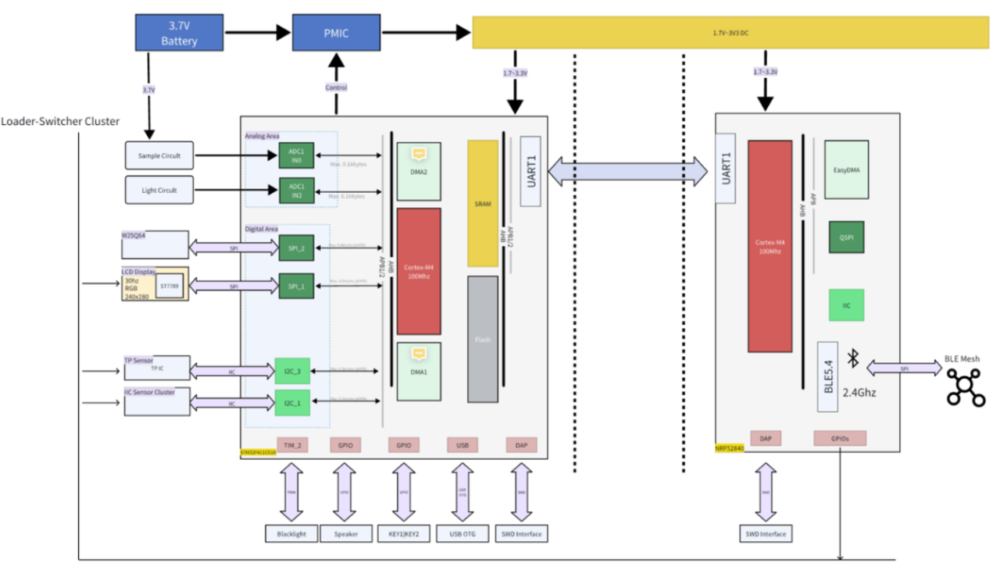

# 硬件设计文档（HDD）

[← 开发流程规范](./MOC.md) | [← 主页](../../../index.md)

> [参考,仅复制](https://twd6onxsxva.feishu.cn/docx/S30xd89WjohxloxJcpgcVLqjn0c)

---

> 原文标题：Stage6_2 硬件设计文档 Hardware Design Document (HDD)

| 产品/项目名称 | EC-S100 受限网络工况下生命体征监控智能手表（STM32F411 + nRF52840 双MCU） |
| --- | --- |
| 文档类型 | Hardware Design Document（HDD）/ 硬件设计文档 |
| 阶段定位 | 承接 HRS，输出“可画原理图/可布板/可产测/可验证”的硬件设计说明 |
| 范围 | STM32F411侧主板+显示/触控/传感器/存储/电源；nRF侧重点描述接口与RF约束 |
| 版本/状态 | V1.0 / Draft（可评审） |
| 编写日期 | 2026-01-02 |

## 文档变更记录

| 版本 | 日期 | 修订内容 | 修订人 | 审核人 |
| --- | --- | --- | --- | --- |
| V1.0 | 2026-01-02 | 基于 HRS (Stage5) 与系统/软件架构输入，形成可落地的硬件设计文档(HDD)：覆盖原理图分块、PCB布局约束、功耗与射频、DFM/DFT与验证计划。 | Liu Yueqi | TBD |

## 1 引言

### 1.1 目的

本文档用于指导 EC-S100 智能手表硬件详细设计与评审，确保硬件实现满足 Stage5 HRS 需求，并与 Stage4 SAD/SID、Stage5 SSRD/SRS 在接口与资源上保持一致。文档面向：硬件工程师、嵌入式软件工程师、测试/QA、结构与制造团队。

### 1.2 范围与非范围

范围：器件选型原则、原理图分块说明、关键信号/电源/时钟/复位设计、PCB布局布线约束、射频与天线、DFM/DFT与产测策略、验证计划。

非范围：手机App与云平台；算法与UI细节；工艺参数与检验规范（由制造文件单独覆盖）。

### 1.3 参考文档

| 编号 | 文档 | 说明 |
| --- | --- | --- |
| REF-1 | Stage5 02 硬件需求规格说明书(HRS) | 本文档的上游需求输入 |
| REF-2 | Stage3 系统需求规格说明书(SyRS) | 系统级约束：离线闭环、弱网场景、定位经手机BLE同步 |
| REF-3 | Stage4 系统架构文档(SAD) / SID / ADR / RAM | 双MCU分工与接口契约 |
| REF-4 | Stage6 01 软件设计说明书(SDD) | 软件对硬件能力依赖：外部Flash、低功耗唤醒、串口链路可靠性等 |

### 1.4 术语与缩写

| 缩写 | 含义 |
| --- | --- |
| HDD | Hardware Design Document / 硬件设计文档 |
| HRS | Hardware Requirements Specification / 硬件需求规格说明书 |
| MCU | Microcontroller Unit / 微控制器 |
| IMU | Inertial Measurement Unit / 惯性测量单元 |
| PPG | Photoplethysmography / 光电容积脉搏波 |
| PMIC | Power Management IC / 电源管理芯片 |
| DFM/DFT | Design for Manufacturing/Test / 可制造/可测试设计 |
| ESD/EMC | 静电放电/电磁兼容 |

## 2 设计输入与关键约束

### 2.1 场景约束(受限网络)

面向矿井/隧道/山区/海上平台等弱网/无网场景：设备必须具备离线采集-告警-存储闭环能力；当与手机建立BLE连接时，完成数据同步与位置同步。GPS不在手表侧实现，定位由手机侧获取并通过BLE同步；NFC不在当前版本范围。

### 2.2 硬件关键指标(摘自HRS)

| 类别 | P0硬约束(摘要) | 落地要点 |
| --- | --- | --- |
| 双MCU | STM32F411主控 + nRF52840 BLE协处理 | UART协议化通信(ACK/超时/CRC)，必要时预留RTS/CTS |
| 时钟 | 提供LSE 32.768kHz | 支持RTC走时与低功耗唤醒(Tickless/Stop) |
| 存储 | 外部NOR Flash &gt;= 8MB | 支持日志/离线数据/OTA缓存，供电与SI保证 |
| 低功耗 | Stop/Tickless + 多唤醒源 | 按键/RTC/传感器中断/UART事件 |
| 接口/产测 | SWD/串口/关键总线测试点 | 支持烧录、校准、功能测试与返修 |

### 2.3 版本裁剪与选配项

| 模块 | 首版状态 | 说明 |
| --- | --- | --- |
| NFC | 不纳入 | 需求变更：删除 |
| GPS | 不纳入(手表侧) | 定位由手机侧经BLE同步 |
| PPG(心率/血氧) | 可选 | 若纳入需同步确定精度与功耗预算 |
| 蜂鸣/振动 | 建议纳入 | 用于告警提示(安全路径) |

## 3 硬件总体架构

### 3.1 系统方框图(文字版)

| [Li-ion Battery] -&gt; [Charger/Protection] -&gt; [Power Rails 3V3/1V8/...]                           \|-&gt; [STM32F411 MCU] &lt;UART&gt; [nRF52840 BLE]                          \|-&gt; [SPI LCD (ST7789)]                          \|-&gt; [I2C Touch Controller]                          \|-&gt; [I2C Sensors: IMU/TempHum/PPG(optional)]                          \|-&gt; [SPI NOR Flash W25Qxx]                          \|-&gt; [Buzzer/Vibration(optional)] |
| --- |

说明：STM32负责UI/采集/存储/功耗；nRF负责BLE连接与手机交互。两者通过UART可靠传输，承载时间同步、定位同步、数据上报与配置下发。

图 3-1 双MCU与外设连接示意(工程资料)

### 3.2 分区与信号域

| 区域 | 包含内容 | 布局要点 |
| --- | --- | --- |
| RF区域 | nRF52840 + 天线 + 匹配网络 | 天线净空、地参考连续、远离高速SPI与背光PWM |
| 数字核心 | STM32F411 + 时钟/复位 + SWD | 去耦就近、时钟走线短、复位稳定 |
| 高速总线 | LCD SPI / Flash SPI | 时钟线串阻可选，等长/回流路径清晰 |
| 模拟/采样 | ADC电池采样/PPG(如有) | 模拟地与数字地策略评审，噪声隔离 |
| 电源区 | 充电/保护/稳压/电感 | 回路面积小、热设计、测试点预留 |

## 4 原理图设计(分块说明)

### 4.1 STM32F411 子系统

| 主题 | 设计要点 | 检查项(评审) |
| --- | --- | --- |
| 供电与去耦 | 每个VDD就近0.1uF + 分区大电容；VDDA独立滤波(若用ADC精度) | 去耦距离&lt;5mm；回流路径 |
| 时钟 | HSE(可选) + LSE 32.768kHz | 晶振负载匹配；LSE走线对称短 |
| 复位/启动 | NRST RC/ESD；BOOT配置固定；上电复位保证 | 慢升压、抖动下复位可靠 |
| 调试口 | SWDIO/SWCLK/NRST/GND测试点 | 治具可达；丝印清晰 |
| 低功耗唤醒 | RTC/按键/外部中断源 | 唤醒脚外部电平不漂移 |

### 4.2 nRF52840 BLE 子系统

| 主题 | 设计要点 | 检查项(评审) |
| --- | --- | --- |
| 供电 | RF与数字供电按参考设计；LDO/DC-DC按官方推荐 | 关键电容/电感按BOM推荐 |
| 接口 | UART与STM32连接；预留RTS/CTS与唤醒脚(可选) | 串口电平一致(3.3V) |
| 调试口 | SWD测试点/连接器 | 烧录/量产/返修可达 |
| 射频 | 天线+匹配网络+净空区 | π网络、地参考连续、净空要求符合 |

注意：射频部分优先遵循Nordic参考设计，任何偏离必须在ADR中记录并做RF验证。

### 4.3 UART互联与协议承载

UART链路为双MCU协作关键路径：承载时间同步、定位同步、生命体征/告警上报、配置下发、日志/OTA分片。硬件需保证抗干扰与可测试：

| 项 | 建议 | 备注 |
| --- | --- | --- |
| 波特率 | &gt;=1Mbps(目标) / 115200(兼容) | 根据板级SI与干扰评估 |
| 流控 | 预留RTS/CTS | 强干扰/大吞吐时提升稳定性 |
| ESD/EMI | 外露连接点增加ESD器件 | 若走线外露/靠近边缘 |
| 测试点 | TX/RX/GND可测 | 便于抓包与故障定位 |

### 4.4 外部Flash(W25Qxx)

| 主题 | 设计要点 | 风险与对策 |
| --- | --- | --- |
| 接口 | SPI(独立CS)，与LCD共享SPI需仲裁 | 共享SPI需确保信号完整性与软件仲裁 |
| 供电 | 擦写峰值电流评估；就近大电容 | 避免擦写期间掉电导致数据不一致 |
| SI | SPI CLK可加串阻；走线短且回流路径清晰 | 高频下EMI与误码风险 |
| WP/HOLD | 按需求上拉/复用 | 避免悬空导致异常 |

### 4.5 显示与触控

| 模块 | 接口 | 设计要点 |
| --- | --- | --- |
| LCD(ST7789或同级) | SPI + DC/RES/BL | 背光PWM噪声隔离RF；SPI高速线走线短 |
| 触控(电容) | I2C + INT | 中断脚用于唤醒；I2C上拉匹配；ESD保护 |

背光PWM建议选高于可见闪烁阈值的频率，并评估对射频与采样噪声影响。

### 4.6 传感器簇(IMU/温湿度/PPG可选)

| 传感器 | 接口 | 关键点 |
| --- | --- | --- |
| IMU(MPU6050或同级) | I2C + INT | INT脚用于运动/跌倒触发；供电可控(选配) |
| 温湿度(AHT21或同级) | I2C | 低频采样；电源噪声不敏感 |
| PPG(可选) | I2C/SPI + LED驱动 | 需要光学结构窗口与模拟噪声控制 |

I2C总线需考虑卡死恢复：上拉电阻选择、总线隔离(必要时)、以及在硬件上避免SCL/SDA长线外露。

### 4.7 电源/充电/电量采样

| 主题 | 设计要点 | 验证 |
| --- | --- | --- |
| 电池 | 单节锂电(3.0-4.2V) + 保护 | 过充/过放/短路保护测试 |
| 充电 | USB/磁吸/触点(方案TBD) | 充电电流、热与EMI评估 |
| 稳压 | 3V3主电源；必要时1V8等子电源 | 负载瞬态与纹波测试 |
| 电量采样 | 分压+RC滤波+ADC | 校准曲线与误差分析 |
| 分域上电 | 传感器/背光等域可控(选配) | 待机功耗显著下降 |

### 4.8 防护(ESD/EMC/反接/过流)

| 位置 | 风险 | 建议措施 |
| --- | --- | --- |
| 充电口/触点 | ESD/浪涌/反接 | TVS + 反接保护 + 限流 |
| 按键/触控 | 手指静电 | ESD器件 + 滤波 + 走线短 |
| 外露金属 | 放电路径不受控 | 定义放电路径与机壳接地策略 |
| 射频区 | EMI耦合导致距离下降 | 分区布局、地参考连续、屏蔽/滤波评估 |

## 5 PCB 设计

### 5.1 层叠与工艺建议(示例)

层叠由PCB厂与项目成本共同确定。建议至少4层：Top(信号)+GND平面+PWR平面+Bottom(信号)。RF区域如需阻抗控制，需与PCB厂确认介质参数。

### 5.2 布局规则(强约束)

| 规则 | 说明 |
| --- | --- |
| RF净空 | 天线下方与前方净空，不走线不铺铜；匹配网络紧靠射频脚 |
| 去耦就近 | MCU/nRF电源去耦电容紧贴引脚，回路最短 |
| 电源回路 | 开关电源回路面积最小，功率电感与二极管布局紧凑 |
| 高速SPI | CLK走线短且参考地连续；必要时串阻抑制振铃 |
| 模拟区隔离 | ADC/PPG等敏感信号远离背光PWM与RF |
| 测试点 | SWD/UART/关键电源/关键总线必须可达，适配治具pogo pin |

### 5.3 走线与SI/PI注意事项

SPI与射频为主要SI风险点：SPI过高频率会带来EMI与误码；射频匹配偏差会导致距离与稳定性下降。建议在原理图预留串阻/匹配位，并在首板进行EMI预扫与通信稳定性测试。

## 6 功耗与热设计

### 6.1 电源轨定义(示例模板)

| 电源轨 | 典型负载 | 峰值风险点 | 测试点 |
| --- | --- | --- | --- |
| VBAT | 全系统 | 背光/射频发射/Flash擦写 | TP_VBAT |
| 3V3_SYS | STM32/Flash/部分传感器 | LCD刷新+Flash并发 | TP_3V3 |
| 3V3_RF | nRF射频域(按参考) | 发射瞬态 | TP_3V3_RF |
| 1V8(可选) | 触控/部分传感器 | 上电瞬态 | TP_1V8 |

### 6.2 功耗预算方法

功耗预算以运行状态划分：Active(亮屏+采集+BLE)、Idle(灭屏+低频采集)、Stop(Tickless)。首板以功耗分析仪测得电流曲线为准，并回填到HRS验证记录。

## 7 射频与天线设计

### 7.1 天线方案

优先选择nRF官方参考设计的PCB天线或认证天线模块。首版推荐保守：复制参考布局与匹配网络，减少不确定性。

### 7.2 匹配与测试

| 项 | 建议 |
| --- | --- |
| 匹配网络 | 预留π型网络(3位元件)；首板通过VNA调优 |
| 地参考 | RF走线下方连续地，过孔围栏(按参考) |
| 射频测试 | 预留RF测试点或同轴焊盘(若需要) |
| 认证预检 | 做BLE距离/吞吐/断连恢复与EMI预扫 |

## 8 DFM/DFT 与产测设计

### 8.1 产测流程(建议)

| 阶段 | 内容 | 输出 |
| --- | --- | --- |
| SMT后ICT(可选) | 开短路/关键器件值/焊接缺陷 | ICT报告 |
| 烧录 | STM32与nRF固件烧录/读回校验 | 烧录日志/版本号 |
| 功能测试 | LCD/触控/传感器/I2C/SPI/UART/Flash/充电 | 功能测试报告 |
| 校准 | 电量ADC校准/RTC校时/传感器偏置(如有) | 校准参数写入CFG区 |
| 射频测试(抽检) | 距离/发射功率/连接稳定性 | RF抽检记录 |

### 8.2 测试点清单(示例)

| 测试点 | 信号 | 用途 |
| --- | --- | --- |
| TP_SWDIO/TP_SWCLK/TP_NRST | STM32 SWD | 烧录/调试/返修 |
| TP_NRF_SWDIO/TP_NRF_SWCLK | nRF SWD | 烧录/调试 |
| TP_UART_TX/TP_UART_RX | STM32&lt;-&gt;nRF | 抓包/联调/故障定位 |
| TP_VBAT/TP_3V3/TP_GND | 电源 | 电流/纹波/掉电测试 |
| TP_I2C_SCL/TP_I2C_SDA | I2C | 传感器/触控诊断 |
| TP_SPI_CLK/TP_SPI_MOSI/TP_SPI_MISO | SPI | LCD/Flash诊断 |

## 9 硬件验证计划(与HRS对齐)

### 9.1 关键验证用例

| 用例ID | 验证项 | 方法 | 通过准则(示例) |
| --- | --- | --- | --- |
| HV-001 | 低功耗Stop/Tickless电流 | T | Stop电流达到目标(由HRS/TBD定义) |
| HV-002 | UART链路抗干扰与丢包恢复 | T/D | 干扰下仍能ACK重传恢复，不死锁 |
| HV-003 | 外部Flash擦写与掉电恢复 | T | 掉电后数据结构可恢复，错误可追踪 |
| HV-004 | BLE连接稳定性与距离 | T | 典型距离满足目标，断连可自动重连 |
| HV-005 | ESD预检(按键/触控/充电口) | T | 不复位/不异常/可恢复 |
| HV-006 | 传感器采样稳定性 | T | 长时间运行无卡死，数据质量达标 |

### 9.2 记录与回填

所有验证结果需记录：测试条件、仪器、原始数据、结论与问题单号(Jira)。通过项回填到HRS验证列，不通过项形成问题闭环(原因-&gt;对策-&gt;再验证)。

## 10 风险与开放项(TBD)

| 编号 | 风险/开放项 | 影响 | 应对策略 |
| --- | --- | --- | --- |
| R-001 | 电池容量与续航目标未最终冻结 | 影响电源与结构 | 先按最小可交付设计，首板实测功耗后再定型 |
| R-002 | PPG是否首版纳入不确定 | 影响结构光路与噪声 | 作为选配子板/可替换器件位预留 |
| R-003 | 射频距离受结构与布板影响 | 影响现场可用性 | 严格参考设计 + 首板VNA调优 + EMI预扫 |
| R-004 | 防水等级目标(TBD) | 影响工艺与成本 | 与结构/制造联合评审，明确IP等级后冻结设计 |

## 附录A：接口与信号映射(模板)

该附录用于列出关键引脚映射与版本差异。最终以原理图网表为准。

| 接口 | 主控引脚(示例) | 外设/器件 | 备注 |
| --- | --- | --- | --- |
| SPI1 | PA5/PA6/PA7 + CSx | LCD/Flash | 共享SPI需独立CS |
| I2C1 | PB6/PB7 | Touch/IMU/AHT21 | 上拉电阻按总线负载选取 |
| UARTx | PAx/PAy | nRF52840 | 预留RTS/CTS |
| ADC | PAx | VBAT分压 | RC滤波 |
| GPIO | PBx | Key/INT/BL | 中断唤醒优先 |

## 附录B：设计评审检查清单(摘要)

| 类别 | 检查项(摘要) |
| --- | --- |
| 原理图 | 电源去耦/复位/时钟/ESD/接口电平/未用引脚处理 |
| PCB | RF净空/地参考/回流/电源回路/高速SPI/测试点可达 |
| DFT | 烧录路径/治具接触/测试覆盖/校准流程 |
| 可靠性 | 掉电保护/过流保护/连接器防松/热设计 |
