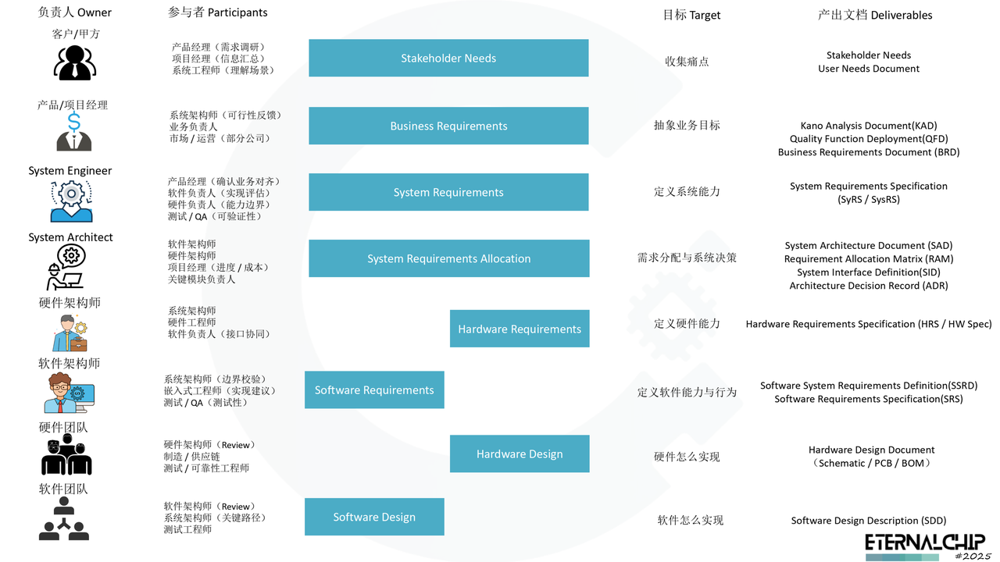

# 开发流程规范 MOC

[← 返回嵌入式工程架构](../MOC.md) | [← 返回技术栈](../../MOC.md) | [← 主页](../../../index.md)

> [参考项目](参考项目介绍.md)

> [PDLC 项目目录模板](./PDLC产品开发生命周期.md)：软件工程师的工程目录与 GitHub 模板。本页汇总全周期开发流程和阶段文档。

---

## 开发流程

## 文档清单

1. [用户需求文档：User Needs Document（UND）](./UND.md)
2. [干系人需求文档：Stakeholder Needs Document（SND）](./SND.md)
3. [需求价值分析文档：Kano Analysis Document（KAD）](./KAD.md)
4. [需求映射与权重分析：Quality Function Deployment（QFD）](./QFD.md)
5. [业务需求文档：Business Requirements Document（BRD）](./BRD.md),
   这个文件夹里有个 `brd-writer`的文件夹里面是一个skill(立芯嵌入式拷贝来的)
6. [产品需求文档：Product Requirements Document（PRD）](./PRD.md)
   这个文件夹里有个 `prd-writer`的文件夹里面是一个skill(立芯嵌入式拷贝来的)
7. [系统需求文档：System Requirements Specification（SyRS / SRSys）](./SyRS.md)
8. [系统架构文档：System Architecture Document（SAD）](./SAD.md)
9. [需求分配矩阵：Requirement Allocation Matrix（RAM）](./RAM.md)
10. [架构决策记录：Architecture Decision Record（ADR）](./ADR.md)
11. [系统需求规格说明书 Software System Requirements Definition（SSRD）](./SSRD.md)
12. [系统需求规格说明书 Software Requirements Specification（SRS）](./SRS.md)
13. [硬件能力手册 Hardware Requirements Specification（HRS）](./HRS.md)
14. [软件设计说明书 Software Design Description（SDD）](./SDD.md)
15. [硬件设计文档 Hardware Design Document (HDD)](./HDD.md)
16. [敏捷规划与需求-代码-测试追踪方案（Agile Plan）](./Agile-Plan.md)
