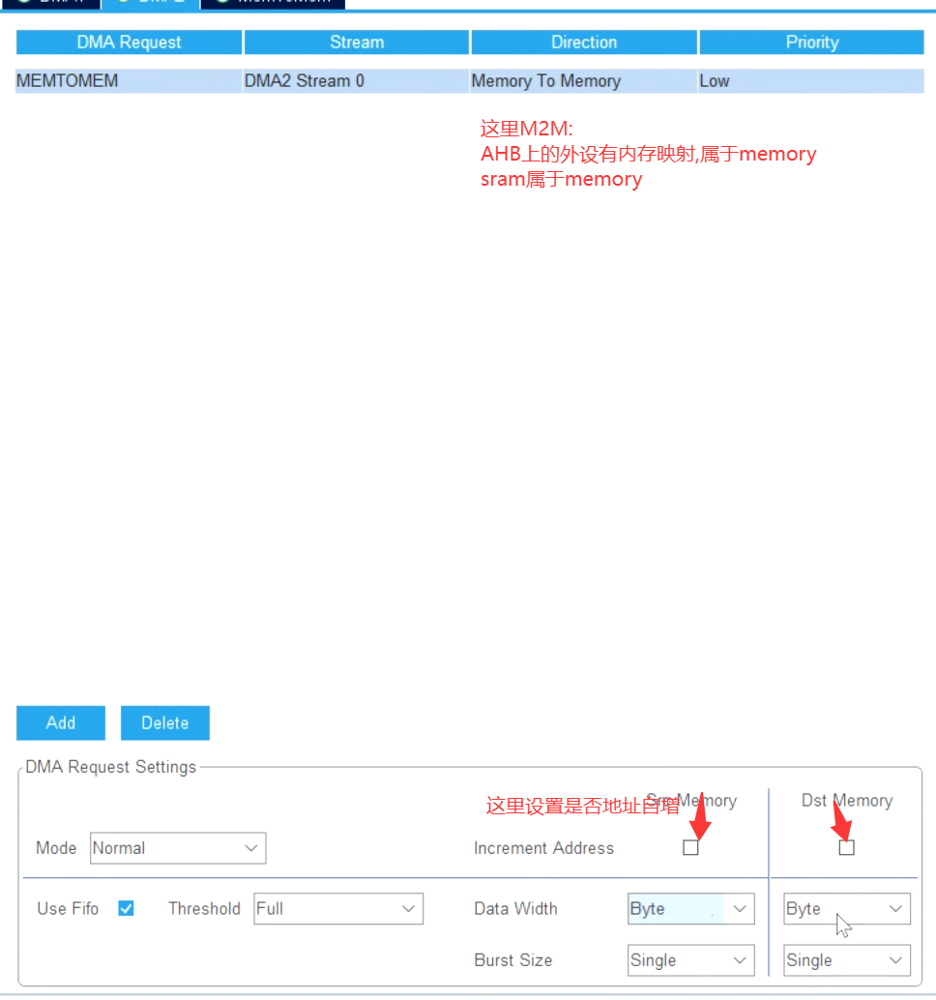
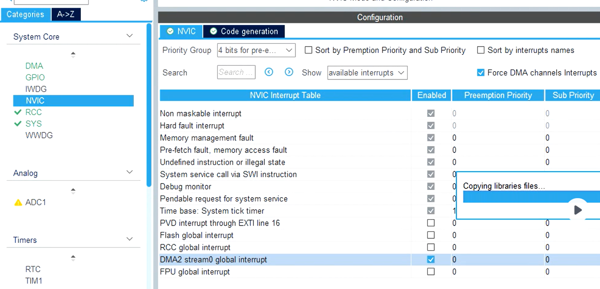

# DMA操作外设GPIO

[← 返回 嵌软高手](./MOC.md) | [← 主页](../../index.md)

---

## 原理

cortex内核里写了[DMA的原理](../Cortex-M4内核原理/DMA.md)

## HAL库配置:

1. 观察[总线矩阵](../Cortex-M4内核原理/总线矩阵.md),需要DMA操作对应的IO口,应该配置那个DMA
2. 

   或者直接HAL库配置:

   ```
   static void MX_DMA_Init(void)
   {
     __HAL_RCC_DMA2_CLK_ENABLE();                                             /* 使能 DMA2 控制器外设时钟 */
     hdma_memtomem_dma2_stream0.Instance = DMA2_Stream0;                      /* 配置 DMA 数据流实例为 DMA2 Stream0 */
     hdma_memtomem_dma2_stream0.Init.Channel = DMA_CHANNEL_0;                 /* 选择 DMA 通道 0 */
     hdma_memtomem_dma2_stream0.Init.Direction = DMA_MEMORY_TO_MEMORY;         /* 设置传输方向为内存到内存 (Memory-to-Memory) */
     hdma_memtomem_dma2_stream0.Init.PeriphInc = DMA_PINC_DISABLE;            /* 禁用外设地址自增 (源地址固定) */
     hdma_memtomem_dma2_stream0.Init.MemInc = DMA_MINC_DISABLE;               /* 禁用内存地址自增 (目标地址固定) */
     hdma_memtomem_dma2_stream0.Init.PeriphDataAlignment = DMA_PDATAALIGN_BYTE;/* 设置外设端数据传输宽度为字节 (8位) */
     hdma_memtomem_dma2_stream0.Init.MemDataAlignment = DMA_MDATAALIGN_BYTE;   /* 设置内存端数据传输宽度为字节 (8位) */
     hdma_memtomem_dma2_stream0.Init.Mode = DMA_NORMAL;                       /* 设置 DMA 模式为普通模式 (单次传输) */
     hdma_memtomem_dma2_stream0.Init.Priority = DMA_PRIORITY_LOW;             /* 设置 DMA 优先级为低 */
     hdma_memtomem_dma2_stream0.Init.FIFOMode = DMA_FIFOMODE_ENABLE;          /* 使能 FIFO 模式 (禁用直通模式) */
     hdma_memtomem_dma2_stream0.Init.FIFOThreshold = DMA_FIFO_THRESHOLD_FULL; /* 设置 FIFO 阈值为满容量触发 */
     hdma_memtomem_dma2_stream0.Init.MemBurst = DMA_MBURST_SINGLE;            /* 设置内存端为单次突发传输 */
     hdma_memtomem_dma2_stream0.Init.PeriphBurst = DMA_PBURST_SINGLE;          /* 设置外设端为单次突发传输 */
     if (HAL_DMA_Init(&hdma_memtomem_dma2_stream0) != HAL_OK)                 /* 初始化 DMA 数据流，失败则进入错误处理 */
     {
       Error_Handler();
     }
   }
   ```
3. 灵活使用这些函数来完成DMA操作

   ```
   stm32f4xx_hal_dma.c
   //开头注释里写了如何启动DMA:HAL_DMA_Start()或者HAL_DMA_PollForTransfer()
   ```
   ```
   stm32f4xx_hal_dma.h
   typedef struct __DMA_HandleTypeDef
   {
     DMA_Stream_TypeDef         *Instance;                                                     /*!< 寄存器基地址（指向具体的数据流，如 DMA1_Stream0） */
     DMA_InitTypeDef            Init;                                                          /*!< DMA 通信配置参数（方向、优先级、数据宽度等）   */ 
     HAL_LockTypeDef            Lock;                                                          /*!< DMA 锁对象（用于互斥访问保护）               */  
     __IO HAL_DMA_StateTypeDef  State;                                                         /*!< DMA 当前传输状态（空闲、忙碌、超时等）         */
     void                       *Parent;                                                       /*!< 父对象指针（指向使用该 DMA 的外设句柄，如 UART）*/ 
     void                       (* XferCpltCallback)( struct __DMA_HandleTypeDef * hdma);      /*!< DMA 传输完成回调函数                          */
     void                       (* XferHalfCpltCallback)( struct __DMA_HandleTypeDef * hdma);  /*!< DMA 传输过半（半完成）回调函数              */
     void                       (* XferM1CpltCallback)( struct __DMA_HandleTypeDef * hdma);    /*!< DMA 内存1传输完成回调函数（双缓冲模式下使用）    */
     void                       (* XferM1HalfCpltCallback)( struct __DMA_HandleTypeDef * hdma);/*!< DMA 内存1传输过半回调函数（双缓冲模式下使用）    */
     void                       (* XferErrorCallback)( struct __DMA_HandleTypeDef * hdma);     /*!< DMA 传输错误回调函数                          */
     void                       (* XferAbortCallback)( struct __DMA_HandleTypeDef * hdma);     /*!< DMA 传输中止（终止）回调函数                  */  
     __IO uint32_t              ErrorCode;                                                     /*!< DMA 错误码（保存溢出、传输错误等标志）         */
     uint32_t                   StreamBaseAddress;                                             /*!< DMA 数据流基地址（用于快速计算中断标志寄存器）  */
     uint32_t                   StreamIndex;                                                   /*!< DMA 数据流索引编号（0~7，用于位移操作清除标志位）*/
   } DMA_HandleTypeDef;
   ```
4. 直接控制GPIO的ODR寄存器(详细看[GPIO](../Cortex-M4内核原理/GPIO.md)):

   ```c
   /* HAL_DMA_Start(句柄, 源地址, 目标地址, 传输长度) */
   HAL_DMA_Start(&hdma_memtomem_dma2_stream0,
                 (uint32_t)&data_gpio[0],    /* 源：内存里的波形数据 */
                 (uint32_t)&GPIOA->ODR,      /* 目标：GPIO 输出寄存器 */
                 1);                         /* 长度按实际数据量填 */

   /* 轮询模式需要自己等传输结束,因为DMA是异步的,如果操作太快,DMA会挂 */
   HAL_DMA_PollForTransfer(&hdma_memtomem_dma2_stream0, HAL_DMA_FULL_TRANSFER, HAL_MAX_DELAY);
   ```
5. 轮询时间无法并行,改用中断:

   

   ```
   // 中断调用链：
   // DMA2_Stream0_IRQHandler(void) -->
   // HAL_DMA_IRQHandler(&hdma_memtomem_dma2_stream0) -->
   // XferCpltCallback --> 挂载 my_dma_TC_Callback() // DMA中断回调函数

   /* USER CODE BEGIN PV */
   uint32_t data_gpio[2] = {0xFF, 0x00};//数组越大,打扰CPU次数越少
   uint32_t counter = 0;
   /* USER CODE END PV */

   /* Private function prototypes -----------------------------------------------*/
   void SystemClock_Config(void);
   static void MX_GPIO_Init(void);
   static void MX_DMA_Init(void);
   /* USER CODE BEGIN PFP */
   void my_dma_TC_callback(DMA_HandleTypeDef *hdma)
   {
       counter++;
       HAL_DMA_Start_IT(&hdma_memtomem_dma2_stream0,
                       (uint32_t)&data_gpio[counter%2],
                       (uint32_t)&GPIOA->ODR,
                       1);
   }
   /* USER CODE BEGIN 2 */
   HAL_DMA_RegisterCallback(&hdma_memtomem_dma2_stream0, HAL_DMA_XFER_CPLT_CB_ID, my_dma_TC_Callback);
   /* USER CODE END 2 */
   ```
