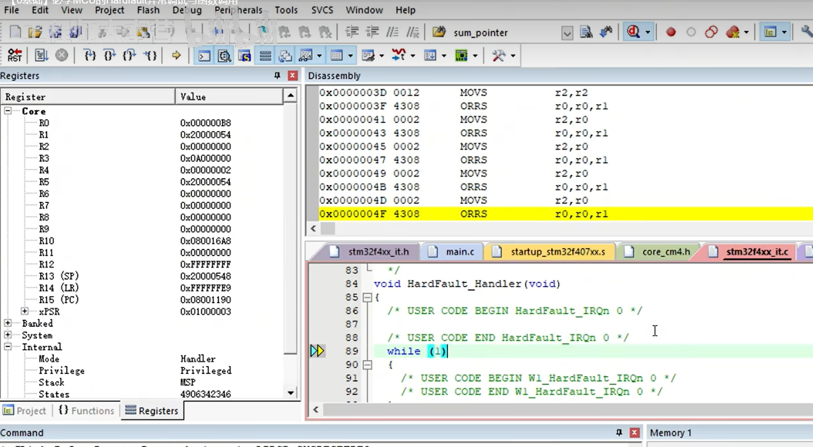
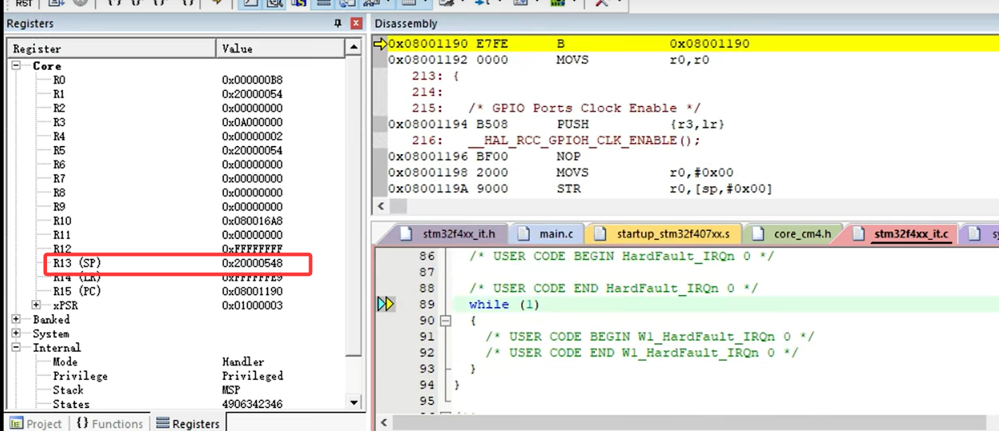
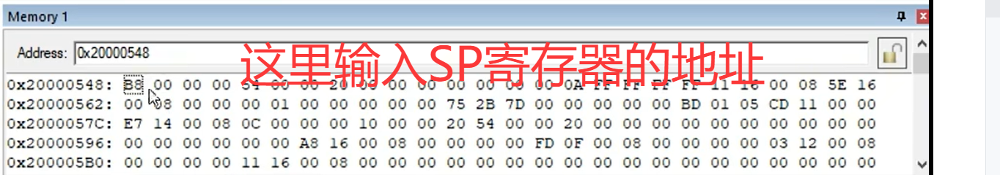
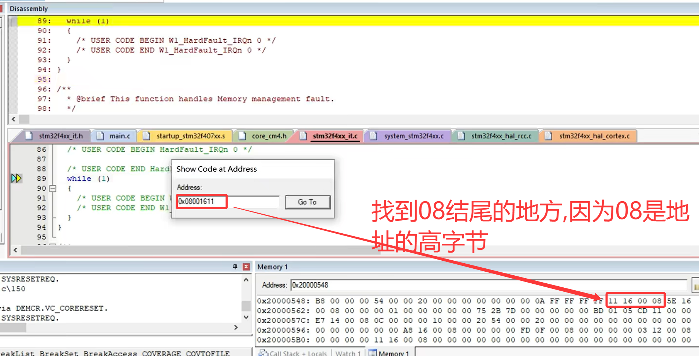
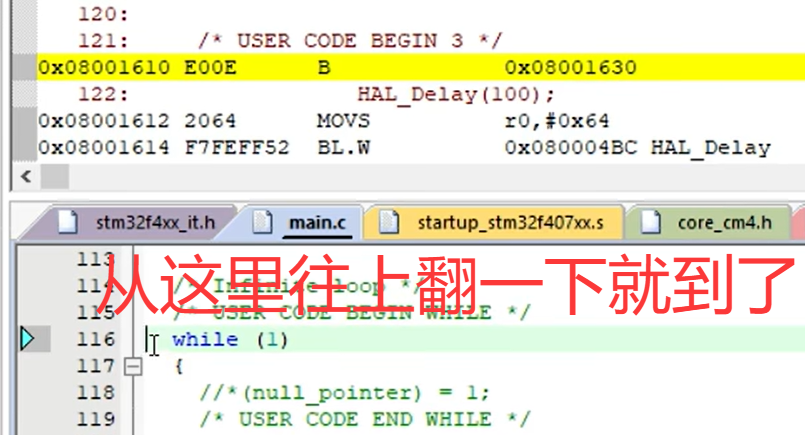

# HardFault 调试：

[← 嵌软高手知识地图](./MOC.md)

---

## 进了 HardFault，怎么定位

进了 `HardFault_Handler` 之后，目标只有一个：**找到是哪条指令炸的**。

### 步骤

1. 先看 **LR（R14）** 的值，判断该查哪根栈指针：

   | LR 值（HEX）    | 含义                                           | 栈回溯查  |
   | --------------- | ---------------------------------------------- | --------- |
   | `0xFFFFFFE9`    | 回到 Thread 模式，用 MSP（带 FPU 的 FreeRTOS 常见） | **MSP**   |
   | `0xFFFFFFF9`    | 回到 Thread 模式，用 MSP（无 FPU）                | **MSP**   |
   | `0xFFFFFFFD`    | 回到 Thread 模式，用 PSP（无 FPU 的任务上下文）     | **PSP**   |
   | `0xFFFFFFED`    | 回到 Thread 模式，用 PSP（带 FPU 的任务上下文）     | **PSP**   |

   > 本质：LR 存在异常时被硬件替换为 `EXC_RETURN`，它的低 4 位编码了返回模式和栈选择。FreeRTOS 任务跑在 PSP 上，如果 LR = `0xFFFFFFFD`，说明是任务里炸的，得去 PSP 里找栈帧。

   Keil 里直接看 R14 寄存器：

   

   

2. 上一步确定的 SP 指向的是硬件自动压栈的栈帧，里面有一项是被压进去的 **PC 值**——它就是触发异常时的程序地址（详见 [PC/LR/SP 寄存器笔记](../Cortex-M4内核原理/PC_LR_SP寄存器.md)）,这里意思是,如果从hardfault出来运行的指令的地址,那么上一条指令就是进入hardfault的地方了

   
3. **看 PC 的上一行**——那条指令就是炸掉的真凶

   

> 为什么看上一行？因为压进栈的 PC 是异常返回后要恢复的地址，也就是出问题那条指令的下一条。所以真正闯祸的是反汇编里 PC 往上一行。

---

## 判断 Fault 类型

Cortex-M 有一个 **CFSR**（Configurable Fault Status Register），地址 `0xE000ED28`，里面的位告诉你 fault 属于哪一类：

| 寄存器        | 全称             | 含义                     |
| ------------- | ---------------- | ------------------------ |
| UFSR (byte2)  | Usage Fault      | 未定义指令、非对齐访问等 |
| BFSR (byte1)  | Bus Fault        | 访问非法地址、总线错误   |
| MMFSR (byte0) | Mem Manage Fault | MPU 违规、访问保护区等   |

Keil 外设窗口里直接看 `NVIC → CFSR`，哪个位置 1 就知道是哪类问题。

常见场景判断：

- **地址非法**：BFSR 置位，通常是野指针、数组越界写到了不可访问的区域
- **未定义指令**：UFSR 置位，PC 跳到了一个不是代码的地方（比如跳进了数据区）
- **栈溢出**：MMFSR 置位或直接 HardFault，栈踩穿了相邻内存。RTOS 任务栈太小是典型原因（见 [MicroLIB 打开原因](./microlib打开原因.md) 中的原因二）

---

> 📎 栈帧结构和硬件自动压栈的详细内容见 [PC/LR/SP 寄存器笔记](../Cortex-M4内核原理/PC_LR_SP寄存器.md)
