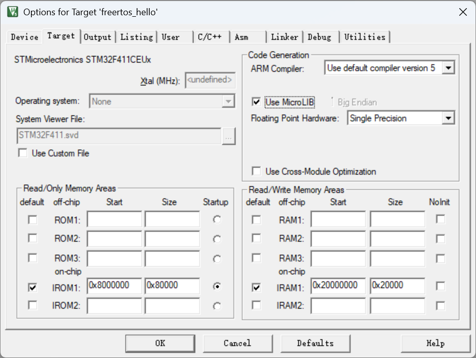

# MicroLIB 打开原因

[← 嵌软高手知识地图](./MOC.md)|←[uart--printf配置](../../库中车马多如簇\UART内含串口助手安装包\printf配置.md)|←[RTT--printf配置](../配置学习\RTT\使用.md)

---

> 程序卡死的核心原因并不全是因为 FreeRTOS，而是 **ARM C 编译器默认标准库行为（半主机模式）** 与 **MCU 独立运行环境** 产生了冲突。
>
> [参考博客](https://shatang.github.io/2020/05/30/%E5%BE%AE%E5%BA%93-%E6%96%AD%E8%A8%80-Keil-%E4%BB%A3%E7%A0%81%E4%BC%98%E5%8C%96/)

---

## 原因一：半主机模式（Semihosting）

Keil 使用默认 C 标准库（不勾选 MicroLIB）时，`printf` 默认走半主机模式：

| 概念         | 说明                                                                                          |
| ------------ | --------------------------------------------------------------------------------------------- |
| 什么是半主机 | 让 ARM 芯片借用宿主机（PC）的屏幕/键盘做 I/O                                                  |
| 卡死机制     | `printf` 底层触发 `BKPT` 软件断点，试图通过仿真器（J-Link/ST-Link）把数据发到 Keil 控制台 |
| 触发条件     | 没接仿真器 / 断开调试后直接上电运行 → 芯片执行到断点指令无主机响应 →**卡死**          |

**MicroLIB 怎么解决**：精简库默认关闭半主机模式，只需重定向 `fputc`，数据就从串口发出，不走断点。

---

## 原因二：任务栈溢出（Stack Overflow）

FreeRTOS 每个任务有独立的固定大小栈：

| 场景              | 说明                                                                                 |
| ----------------- | ------------------------------------------------------------------------------------ |
| 标准库 `printf` | 庞大、耗栈，格式化浮点/复杂字符串可能吃掉几百~上千字节                               |
| 栈溢出            | 任务栈（如 128 words）不够撑标准库 `printf` → **HardFault_Handler** → 卡死 |

**MicroLIB 怎么解决**：代码尺寸和内存高度优化，`printf` 栈消耗大幅降低，RTOS 任务中栈溢出风险显著减小。

> 📎 HardFault 的定位方法（看栈帧、找 PC、反推出问题的指令）见 [HardFault 调试](../debug方法/HardFault调试.md)

---

## 原因三：底层依赖与重定向复杂度

| 对比项       | 标准库（不用 MicroLIB）                                     | MicroLIB                      |
| ------------ | ----------------------------------------------------------- | ----------------------------- |
| 串口重定向   | 除了 `fputc`，还得手动实现 `_sys_exit`、`_ttywrch` 等 | 只需一个 `fputc`            |
| 半主机关闭   | 需显式声明关闭                                              | 默认关闭                      |
| 底层文件 I/O | 依赖大量 OS 级文件 I/O                                      | 去掉了，为裸机/轻量 RTOS 设计 |
| 漏写后果     | 底层调度陷入死循环                                          | —                            |
