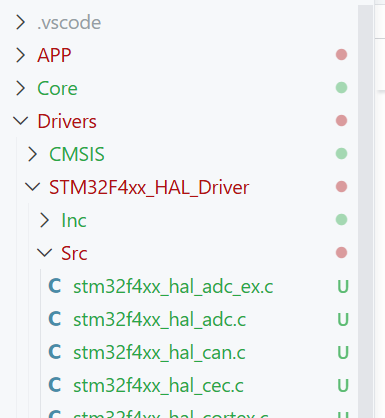
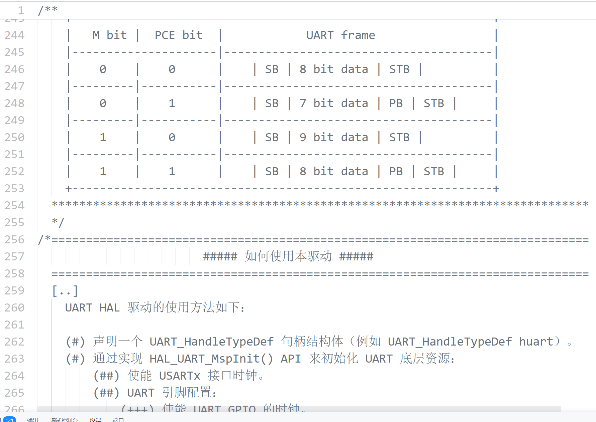

# 如何使用HAL库

[← 嵌软高手知识地图](./MOC.md)

> HAL 库不需要到处找教程——HAL库的作者在 Driver 文件里已经把用法写好了。

---

## 方法:

1. **找到 Driver 文件夹**
   STM32 HAL 库项目中，`Drivers/STM32Fxxx_HAL_Driver/` 下有所有外设的 `.c` 和 `.h` 文件
2. **读头文件的注释**
   每个 `stm32fxxx_hal_xxx.h` 的顶部有 **How to use this driver** 章节，ST 官方写了完整的使用步骤、初始化流程、API 调用顺序
3. **AI 翻译成中文**
   把英文注释整段丢给 AI，翻译成中文对照阅读
4. **跟着教程写代码**
   按翻译后的步骤一步步调用 API，就是正确的 HAL 用法
