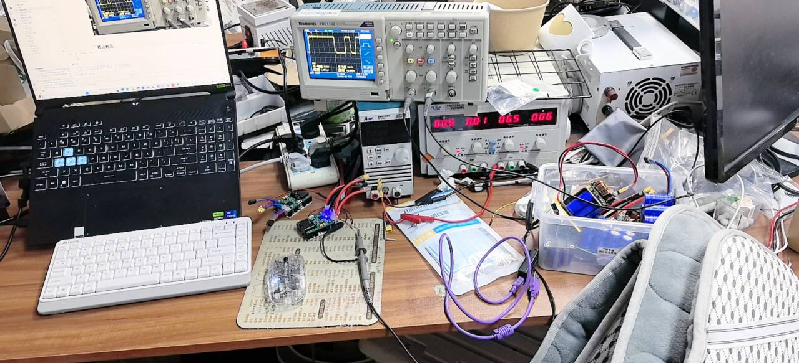
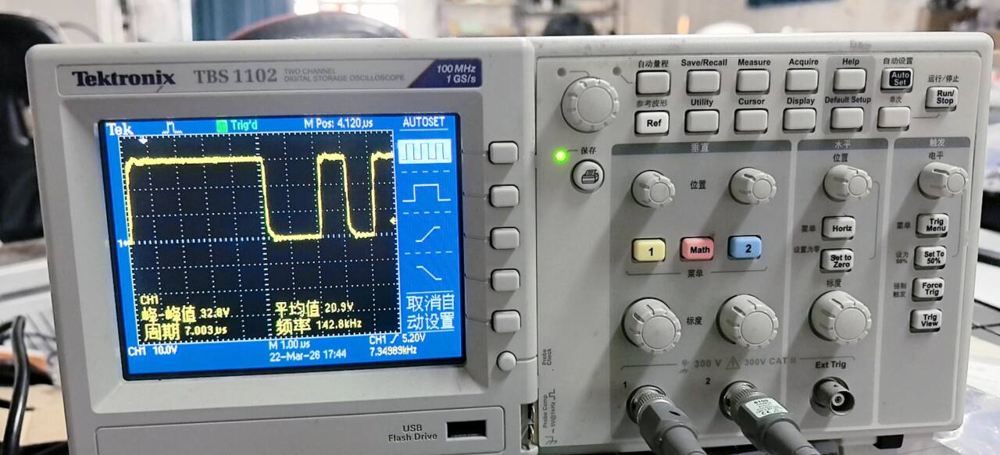
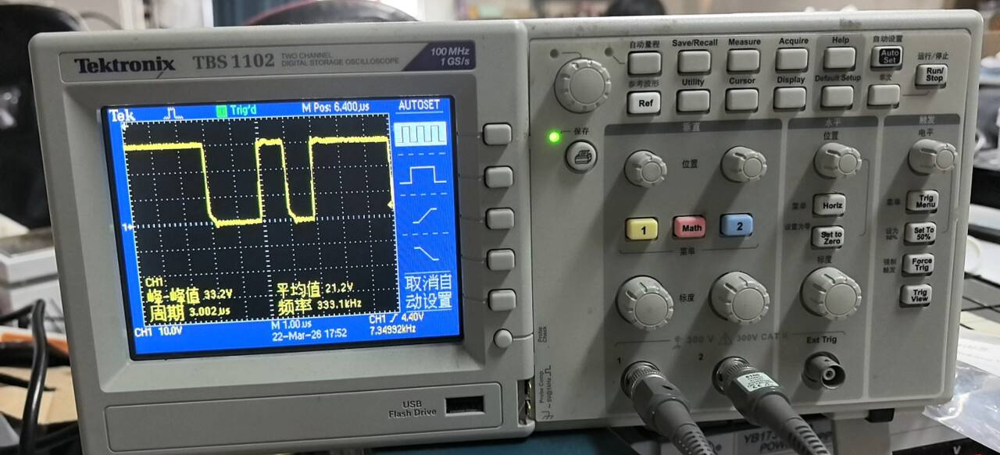
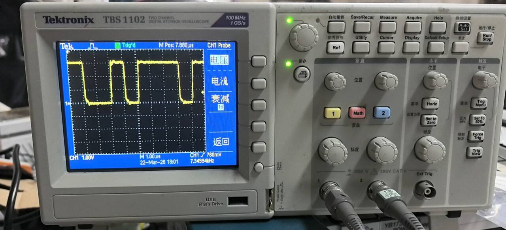

# 示波器

[← 返回 MOC](MOC.md) | [← 主页](../index.md)|[←UART](../库中车马多如簇/UART内含串口助手安装包/MOC.md)|←[万用表](万用表.md)

> **一句话**：示波器是用于观测电信号波形的电子测量仪器。

---

下图按钮

1,接负极正极

先按autoset看看可以设置个大概

2,***垂直位置旋钮***可以把波形上下移动

***垂直标度旋钮***可以更改波形峰值和低谷的差距,也就是高度

***水平位置按钮***可以看波形的整体,就像这样,波形向左了

***水平标度旋钮***可以把波形变宽变胖

***触发电平旋钮***可以把箭头的当前的点烟的片段截取出来然后叠加,这是使波形静止的关键

图中的电压不对,是因为设置了探头衰减,可以按黄色的按钮(测量头的按钮,进入设置衰减),下图就对了

## 注意细节

26/4/19
今天用示波器的时候把芯片烧了,示波器和[万用表](万用表.md)不同,他的地不是浮空的,而是被拉到了地线,而芯片用的电源箱供电,我把示波器当成万用表测,把地接到了高电压位置,结果短路了

示波器不适合测量电压,精度不如万用表,而且一端必须接地

---
