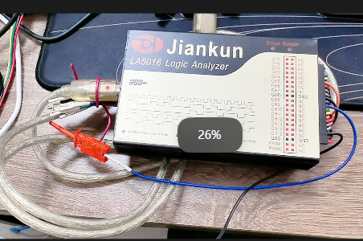
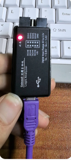

# 逻辑分析仪

[← 返回 MOC](MOC.md) | [← 主页](../../../README.md)|[←UART](../库中车马多如簇/UART内含串口助手安装包/MOC.md)

---

这个是我比较喜欢用的一款,[软件安装下载官网](https://www.qdkingst.com/cn/download-vis)

这个是便宜的国产,采集点时间间隔越来越大,避雷,最后用旁边的示波器一点一点肉眼翻译😭

---

## 本章小结
