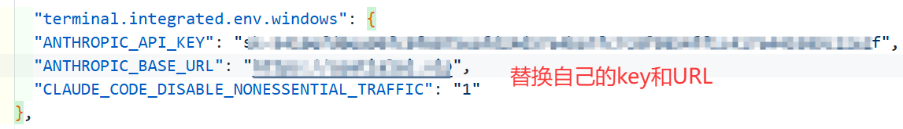
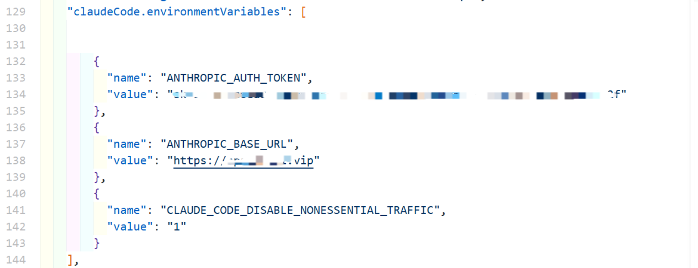

## AI基础知识记录

[← 返回 MOC](MOC.md) | [← 主页](../../index.md)

## 基础知识记录

**API** 的全称是 Application Programming Interface（应用程序编程接口）。

## 如何接入API:

本人只用过VScode

如果有过购买CC的经历,因为各家的设置不同,可能会出现覆盖现象,我们要统一设置把旧的删掉!

### 1删环境变量:

设置进入"高级系统设置",因为删除要管理员权限--->环境变量---->在系统变量里删除`ANTHROPIC_AUTH_TOKEN`和`ANTHROPIC_BASE_URL`

### 2删掉Claude Code 的 settings.json

"C:\Users\17443\.claude\settings.json"大概在这里

这里的17443是我的系统名,根据自己的改,粘贴进去,从这里设置太麻烦

```
{
  "includeCoAuthoredBy": false,
  "permissions": {
    "allow": [
      "Bash(python:*)"
    ]
  },
  "model": "sonnet[1m]"
}
```

### 3使用 VS Code 官方的终端环境变量注入字段

打开C:\Users\17443\AppData\Roaming\Code\User\settings.json,也就是ctrl+shift+p--->选择:打开用户设置(josn)--->




没有就在末尾添加上

```
"terminal.integrated.env.windows": {
    "ANTHROPIC_API_KEY": "sk-xxxxxxxxxxxxxxxxxxxxxxxxxxxxxxf",
    "ANTHROPIC_BASE_URL": "https://xxx.xxx",
    "CLAUDE_CODE_DISABLE_NONESSENTIAL_TRAFFIC": "1"
  },
```

有的人根据官方设置长这样的,是因为他们用的Claude Code 的 settings.json,如果按照我的设置,要改掉,如果还是不行,那就是有其他问题,就改回去吧



## 如何选择API中转站:

https://llmtest.cn/leaderboard
这个网站是CC的中转站榜单,还有测试CCapi的功能,跟着里面选就好了
codex感觉不太好用,不过是真的便宜(2026/4/8:一些中转站可以做到0.05倍率),可以当做CLI版的豆包来用

推荐一家https://spatialai.vip/
