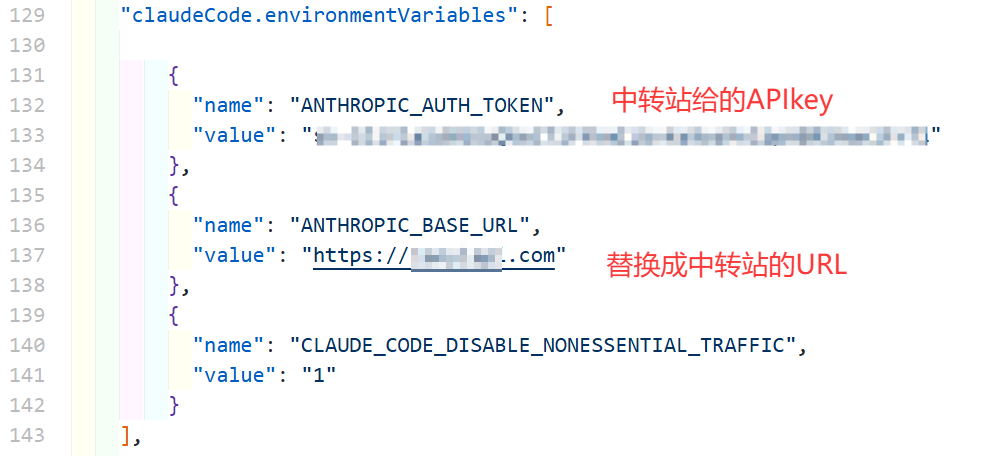

## AI基础知识记录

[← 返回 MOC](MOC.md) | [← 主页](../README.md)

## 基础知识记录

**API** 的全称是 Application Programming Interface（应用程序编程接口）。

## 如何接入API:

打开C:\Users\17443\AppData\Roaming\Code\User\settings.json,也就是ctrl+shift+p--->选择:打开用户设置(josn)--->

没有就在末尾添加上

## 如何选择API中转站:

https://llmtest.cn/leaderboard
这个网站是CC的中转站榜单,还有测试CCapi的功能,跟着里面选就好了
codex感觉不太好用,不过是真的便宜(2026/4/8:一些中转站可以做到0.05倍率),可以当做CLI版的豆包来用
