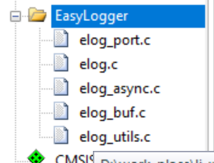
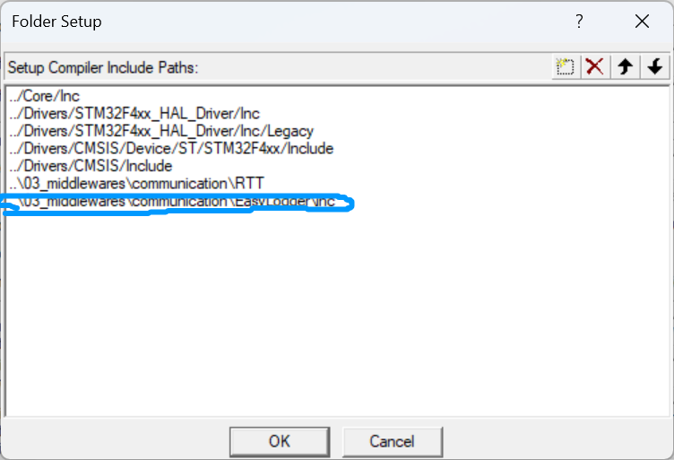
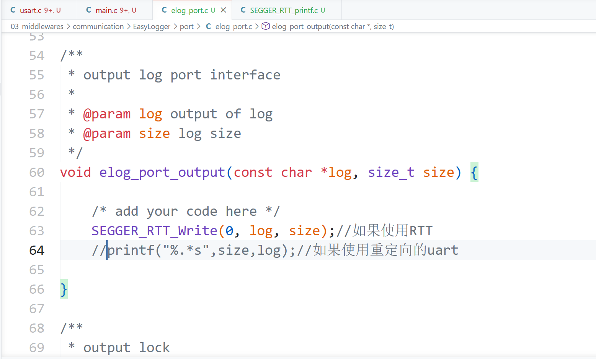

# EasyLogger

[← 返回配置学习](./MOC.md) | [← 主页](../../index.md)

> [GitHub网址](https://github.com/armink/EasyLogger?tab=readme-ov-file)

---

## keil配置

1. 我放到toolchains里了

   
2. keil编译包含:并且包含头文件

## 代码部分:

1. 

   `03_middlewares\communication\EasyLogger\port\elog_port.c`里的 `elog_port_output`函数改一下,如图
2. 这里我对源文件做出了如下修改(toolchains里的已经改好了):关闭 `EasyLogger\inc\elog_cfg.h`里68行异步输出的宏定义,还有79行的缓冲输出
3.
