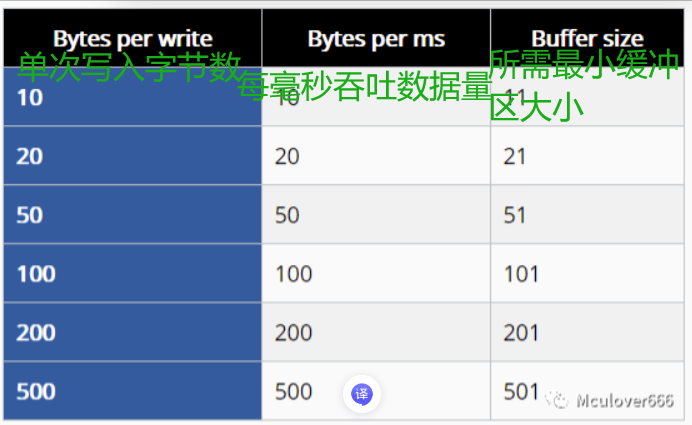

# RTT 原理

[← 返回 RTT](./MOC.md) | [← 配置学习](../MOC.md) | [← 主页](../../../index.md)

---

## 一、 核心工作原理

RTT 的本质是： **利用调试器（J-Link）在 MCU 运行时“悄悄”读写 MCU 的 SRAM** 。

在 ARM Cortex-M 等架构中，调试接口（DAP, Debug Access Port）拥有直接访问总线和 SRAM 的权限。这意味着 J-Link 可以在 **完全不暂停 CPU 运行** 的情况下，通过 SWD/JTAG 硬件引脚直接读取或写入 RAM 中的某块区域。

 

> SEGGER RTT 控制块与环形缓冲区. **Source: SEGGER Knowledge Base**

## 二、 内部数据结构：控制块与环形缓冲区

RTT 在 MCU 的 RAM 中开辟了一块名为 **控制块（Control Block）** 的数据结构，里面维护着若干个 **环形缓冲区（Ring Buffer / FIFO）** 。

### 1. 控制块结构 (`SEGGER_RTT_CB`)

当程序初始化 RTT 时，内存中会存在这样一个结构：

* **Identifier（标识符）** ：固定的字符串（如 `"SEGGER RTT"`）。J-Link 连接时，会在 RAM 中扫描这个特征码来找到控制块的首地址。
* **Up Buffers（上行缓冲区数组）** ：MCU **→** PC（例如输出 Log、调试打印）。
* **Down Buffers（下行缓冲区数组）** ：PC **→** MCU（例如从电脑控制台输入指令）。

### 2. 环形缓冲区的无锁协作机制

每个 Up/Down Channel 都是一个典型的 **单生产者 - 单消费者（SPSC）环形缓冲区** ，依靠两个指针/偏移量协同工作：

以最常用的 **Up Buffer（日志打印）** 为例：

| 角色                      | 操作项                      | 职责描述                                                                           |
| ------------------------- | --------------------------- | ---------------------------------------------------------------------------------- |
| **MCU (生产者)**    | **`WrOff`(写偏移)** | 负责将 `printf`的字符写入内存，并递增 `WrOff`。当到达缓冲区末尾时折返回 0。    |
| **J-Link (消费者)** | **`RdOff`(读偏移)** | 轮询读取 `RdOff`到 `WrOff`之间的未读数据发送给电脑，读取完毕后更新 `RdOff`。 |

> **为什么不需要加锁？**
>
> 因为 MCU 只写 `WrOff`、只读 `RdOff`；J-Link 只写 `RdOff`、只读 `WrOff`。这种“单向写指针”的设计避免了复杂的锁竞争，让 MCU 的写入逻辑极度精简。

## 三、 缓冲区满了怎么办？（三种工作模式）

当 MCU 打印日志的速度超过了 J-Link 通过 SWD 吞吐数据的速度时，Up Buffer 就会装满。RTT 提供了三种处理策略：

1. **`SEGGER_RTT_MODE_NO_BLOCK_SKIP`（默认 - 非阻塞丢弃）**
   缓冲区满时直接跳过新数据， **绝对不阻塞 CPU** 。适合对实时性要求极高的场景（如电机控制圈、高频中断）。
2. **`SEGGER_RTT_MODE_NO_BLOCK_TRIM`（非阻塞截断）**
   能装下多少就写多少，装不下的丢弃。
3. **`SEGGER_RTT_MODE_BLOCK_IF_FIFO_FULL`（阻塞等待）**
   等待 J-Link 把数据读走腾出空间再继续写。 **能保证 Log 完整不丢包** ，但在 J-Link 未连接或读取慢时会拖慢主程序速度。

官方推荐配置:

## 四、 为什么 RTT 这么快？

1. **无硬件波特率限制** ：传统的 UART 需要按照 115200 或 921600 波特率逐个 Bit 发送；RTT 只是在内存中做了一次 `memcpy`，性能仅受限于 RAM 读写速度。
2. **零中断开销** ：不需要为了发送串口数据而频繁触发 TX 完成中断或占用 DMA 通道。
3. **支持多通道（Multi-Channel）** ：你可以开辟 Channel 0 打印标准文本 Log，Channel 1 发送二进制 Waveform 数据给上位机绘制波形（如 J-Scope），互不干扰。
