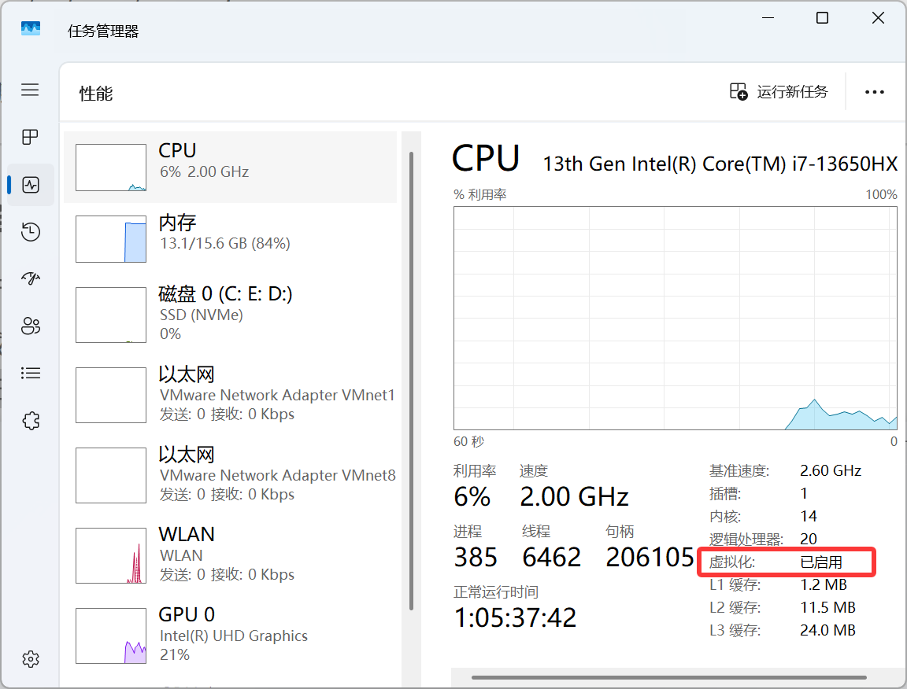
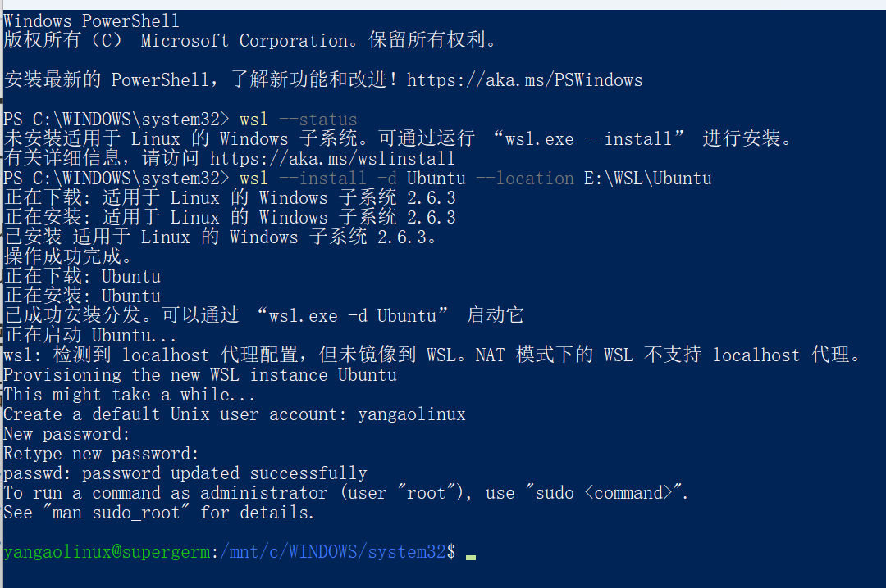

# WSL与Linux环境

[← 返回 MOC](MOC.md) | [← Linux系统](../Linux系统/MOC.md) | [← 主页](../../index.md)

---

## 1. WSL 是什么

WSL 的全称是 Windows Subsystem for Linux, 可以在 Windows 里直接跑 Linux 命令行、开发工具链和常见服务。

它不是传统意义上的完整 Linux 桌面虚拟机, 但如果你的目标是:

- 跑 Linux 命令
- 配置 Git / Python / C / C++ / Node.js 开发环境
- 做编译、脚本、容器相关开发

那直接上 **WSL 2** 就够用了, 一般也比再装一套 VirtualBox 更省事。

---

## 2. 安装前先确认

建议先确认下面几件事:

- Windows 11, 或 Windows 10 2004 及以上版本
- BIOS / UEFI 里已经打开虚拟化
- 用 **管理员身份** 打开 PowerShell

可以先看一下有没有装,后面安装是否成功也用这个看看

```powershell
wsl --status
wsl --version
```

---

## 3. 最简单的安装方法

### 方案 A: 默认安装 Ubuntu

管理员 PowerShell 里直接执行:

```powershell
wsl --install
```

这条命令通常会自动完成:

- 启用 WSL
- 启用 Virtual Machine Platform
- 安装最新 Linux kernel
- 默认安装 Ubuntu
- 默认使用 WSL 2

执行完成后, 按提示 **重启 Windows**。

### 方案 B: 指定发行版

先看可选发行版:

```powershell
wsl --list --online
```

再安装你想要的版本, 例如 Ubuntu:

```powershell
wsl --install -d Ubuntu
```

如果你更偏向稳定纯净一点, Debian 也可以:

```powershell
wsl --install -d Debian
```

### 方案 C: 直接装到 D 盘

如果你的 WSL 版本比较新, 可以直接指定安装位置:

```powershell
wsl --install -d Ubuntu --location D:\WSL\Ubuntu
```

如果这里提示参数不支持, 就先正常安装, 然后用第 6 节的导出 / 导入方法迁移到 D 盘。

---

## 4. 第一次启动要做什么

第一次打开 Ubuntu 时, 系统会让你创建:

- Linux 用户名
- Linux 密码

注意: **输密码时屏幕不会显示任何字符**, 这是正常现象。



进系统后建议先更新软件源和基础工具:这些东西都下载到E盘wsl里和ubuntu一起了

```bash
sudo apt update
sudo apt upgrade -y
sudo apt install -y build-essential git curl wget unzip zip vim
```

顺手确认一下当前系统信息:

```bash
uname -a
cat /etc/os-release
whoami
```

---

## 5. 常用 WSL 命令

### Windows 侧常用命令

```powershell
wsl -l -v
wsl --set-default Ubuntu
wsl --set-default-version 2
wsl --update
wsl --shutdown
wsl -d Ubuntu
wsl ~
```

这些命令分别用来:

- `wsl -l -v`: 查看已安装发行版和 WSL 版本
- `wsl --set-default Ubuntu`: 设置默认发行版
- `wsl --set-default-version 2`: 后续新装发行版默认走 WSL 2
- `wsl --update`: 更新 WSL 本体
- `wsl --shutdown`: 关闭所有 WSL 实例
- `wsl -d Ubuntu`: 进入指定发行版
- `wsl ~`: 直接进入 Linux 用户主目录

### Linux 侧常用命令

```bash
cd ~
pwd
ls
explorer.exe .
```

`explorer.exe .` 这条很好用, 可以直接把当前 Linux 目录用 Windows 资源管理器打开。

---

## 6. 已经装好了, 想迁移到 D 盘

如果一开始没指定 `--location`, 可以用导出 / 导入的方式迁移。

先关掉所有 WSL:

```powershell
wsl --shutdown
```

然后导出当前发行版:

```powershell
wsl --export Ubuntu D:\WSL\backup\Ubuntu.tar
```

确认导出文件已经存在以后, 再注销旧发行版:

```powershell
wsl --unregister Ubuntu
```

再导入到新位置:

```powershell
wsl --import Ubuntu D:\WSL\Ubuntu D:\WSL\backup\Ubuntu.tar --version 2
```

> `wsl --unregister Ubuntu` 会直接删除原来的发行版数据, 一定要先确认 `Ubuntu.tar` 已经导出成功。

### 导入后默认用户变成 root 怎么办

`--import` 进来的发行版, 默认用户可能会变成 `root`。

这时先进入系统:

```powershell
wsl -d Ubuntu -u root
```

然后编辑 `/etc/wsl.conf`, 写成这样:

```ini
[user]
default=你的用户名
```

保存后退出, 再回到 PowerShell 执行:

```powershell
wsl --terminate Ubuntu
wsl -d Ubuntu
```

重新打开后, 默认用户就会切回你自己的 Linux 账号。

---

## 7. 我建议你这样用

### 1. Linux 项目尽量放在 Linux 文件系统里

如果你主要在 WSL 里开发, 推荐把项目放在:

```bash
~/code
```

~:**家目录快捷符号** = 你的 Linux 专属主文件夹（相当于 Windows 的「用户文件夹 / 我的文档」）

比如:

```bash
mkdir -p ~/code
cd ~/code
```

这是在家目录创建一个code文件夹,然后进入到这个文件夹

家目录相当于windows里的C:\Users\你的用户名

不要长期把大型项目放在:

```bash
/mnt/c/Users/你的用户名/...
```

这是window的C盘,并且运行linux慢

### 2. Windows 里也能访问 Linux 文件

在 Windows 资源管理器里可以直接打开:

```text
\\wsl$\Ubuntu\home\你的用户名
```

### 3. 配合 VS Code 会很舒服

如果你装了 VS Code, 在 WSL 里进入项目目录后可以直接:

```bash
code .
```

这样会直接用 **Remote - WSL** 方式打开项目。

---

## 官方文档

- [Microsoft 官方安装文档](https://learn.microsoft.com/en-us/windows/wsl/install)
- [WSL 常用命令](https://learn.microsoft.com/en-us/windows/wsl/basic-commands)
- [WSL 开发环境建议](https://learn.microsoft.com/en-us/windows/wsl/setup/environment)
