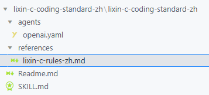
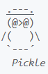
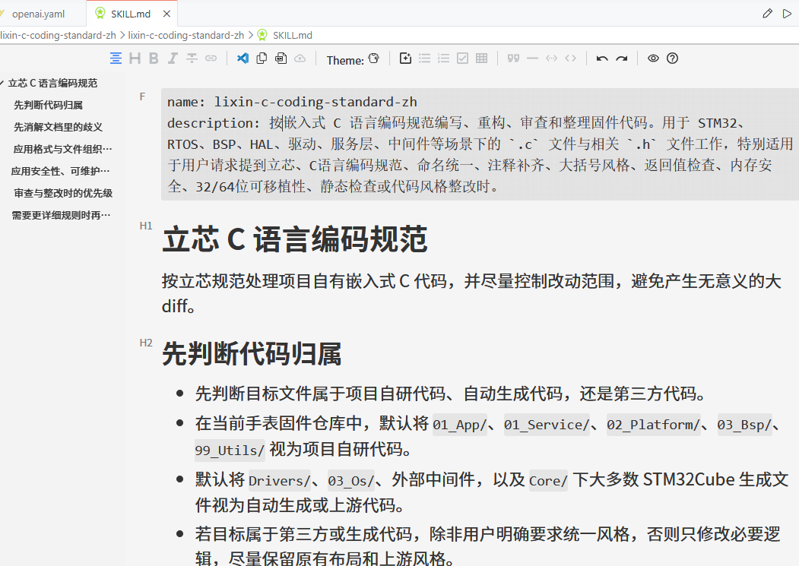
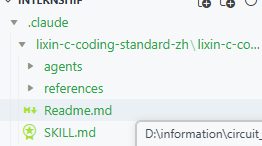
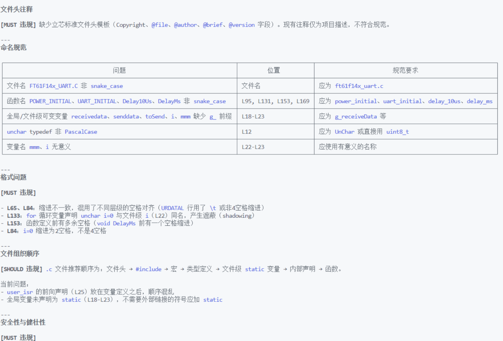

# SKILL基础学习

[←返回配置学习MOC ](../MOC.md)|[←skillMOC](MOC.md)

---



这是一个SKILL的配置文件,立芯

## 目的:

省输入提示词,让AI更加规范,缩短部分重复的开发任务

---

## 文件组成:

### .yaml

**YAML** （读作 /ˈjæməl/）是一种极其简洁、 **人类可读的数据序列化语言** 。它的全称是一个有趣的递归缩写：“YAML Ain't Markup Language”（YAML 不是一种标记语言）

核心语法：键值对,**冒号加一个空格** `key: value` 来表示,层级关系：依靠空格缩进

```
interface:
  display_name: "立芯 C 标准"
  short_description: "按立芯规范处理嵌入式 C 代码"
  default_prompt: "使用 $lixin-c-coding-standard-zh 按立芯 C 语言编码规范编写、重构或审查嵌入式 C 代码。"
```

CC不需要这个,只需要一个SKILL就好了,这个是openai,GitHub copilot的agent才需要的前端界面

CC今天出的/buddy小宠物,希望CC不要倒闭

---

### SKILL.md



注意上面的

```
name: lixin-c-coding-standard-zh
```

这是yaml和skill的桥梁,可以调用这个skill了

然后这里面就可以写你想要的SKILL了,立芯的这个写了很多的代码规范,这个⭐**比较适合审查自己写的代码**

获取放到MOC里

---

## 使用:

CC:

放到这里,全拖过来,然后说对应提示词:比如立芯嵌入式标准

样例输出:


